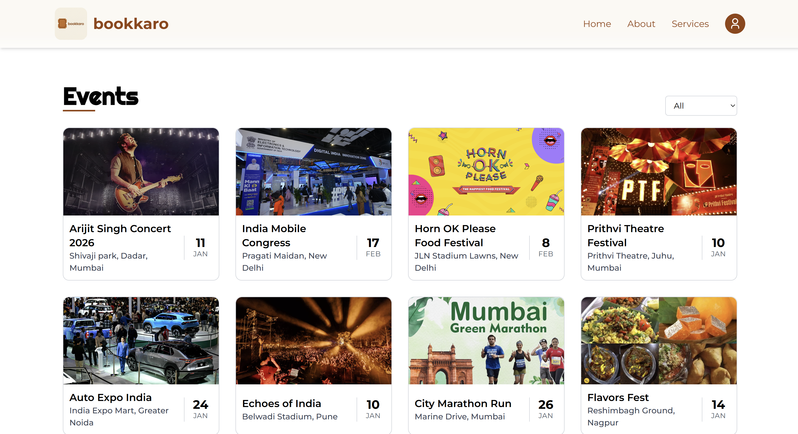
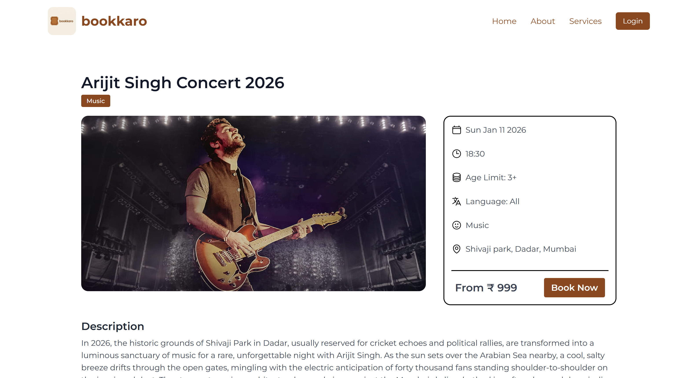
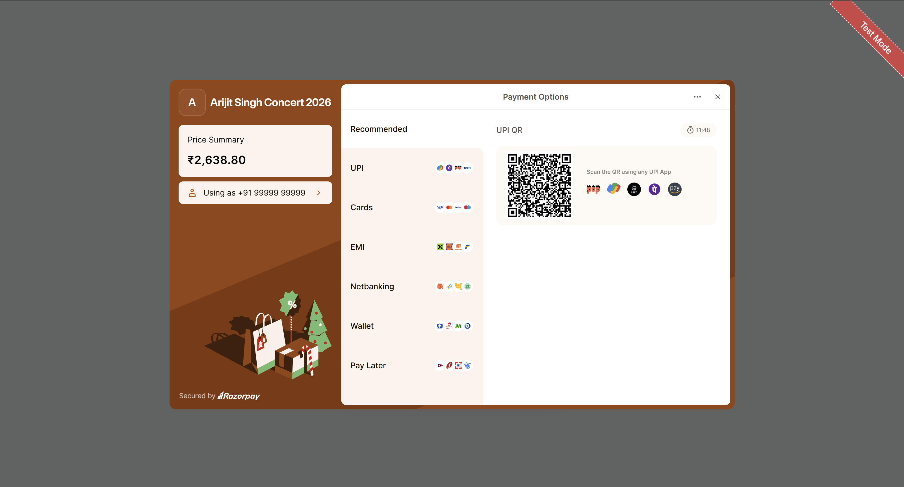

# 🎫 bookkaro – Frontend

bookkaro is a responsive event booking platform built using React.  
This repository contains the **frontend** of the bookkaro application.

---

## 🚀 Features

- Responsive landing page
- Event listing & filtering
- Event details page
- Different ticket prices
- Ticket booking UI
- Razorpay checkout integration
- Smooth animations using Framer Motion
- Protected routes (login required)

---

## 🧑‍💻 Tech Stack

- React.js
- Tailwind CSS
- Framer Motion
- Axios
- React Router DOM
- JWT-based authentication

---

## 🌐 Live Demo

🔗 **Frontend:**  
https://bookkaro-frontend.vercel.app

🔗 **Backend Repo:**  
https://github.com/utkarsh636-developer/bookkaro-backend-project

> Note: This repository contains the backend APIs for bookkaro along with server-rendered EJS pages used only for admin operations.
> The application is intended to be accessed via the React frontend; EJS pages are not meant for public interaction.

---

## 📸 Screenshots

### Landing Page


### Events Listing


### Event Details & Booking


### Payment Page


---

## 🛠️ Installation & Setup

```bash
git clone https://github.com/utkarsh636-developer/bookkaro-frontend
cd bookkaro-frontend
npm install
npm run dev 
```

## ⚙️ Environment Variables

Create a `.env` file in the project root:

```env
VITE_API_BASE_URL=https://bookkaro-backend-project.onrender.com
```

> Note: The backend root URL may render server-side EJS pages for admin use.
> The application is intended to be accessed via the React frontend; API routes are consumed programmatically.

## 📁 Folder Structure

```
src/
├── components/
├── context/
├── layouts/
├── api.jsx
├── App.jsx
```

## 🙌 Author

Utkarsh Kankal
GitHub: https://github.com/utkarsh636-developer   
LinkedIn: https://www.linkedin.com/in/utkarsh-kankal-200152350/
